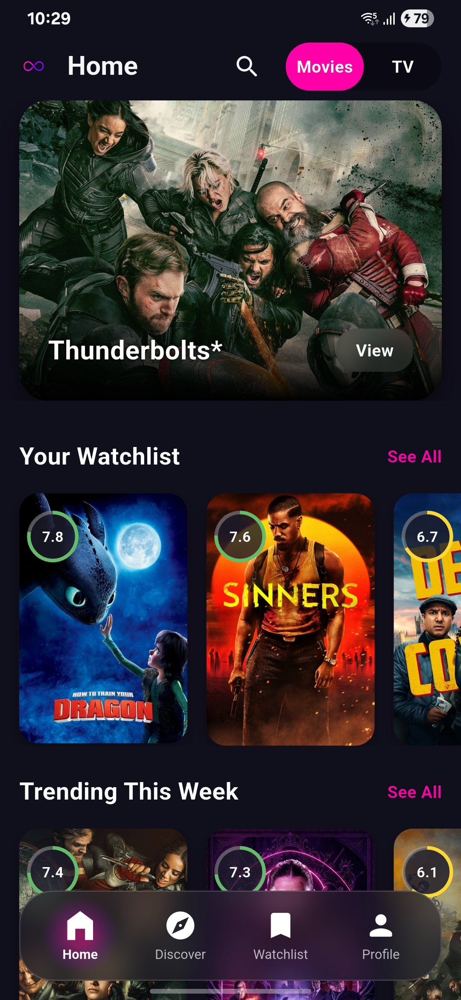
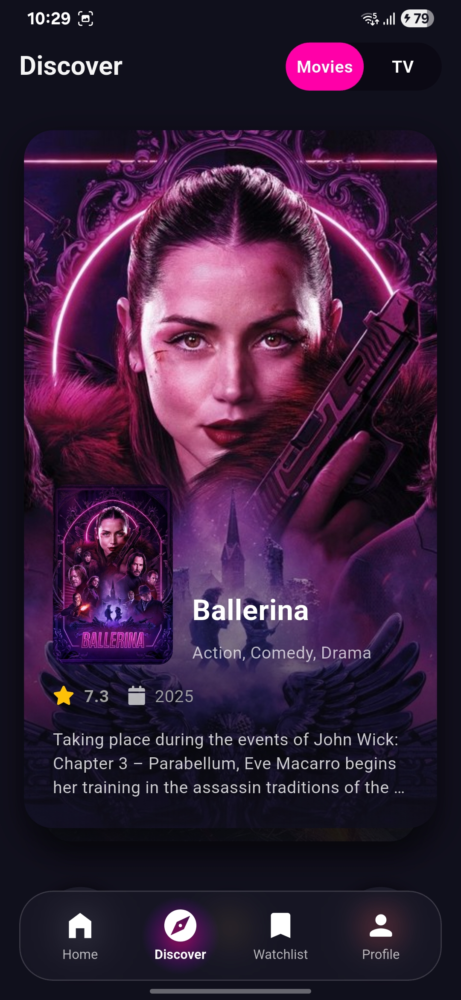
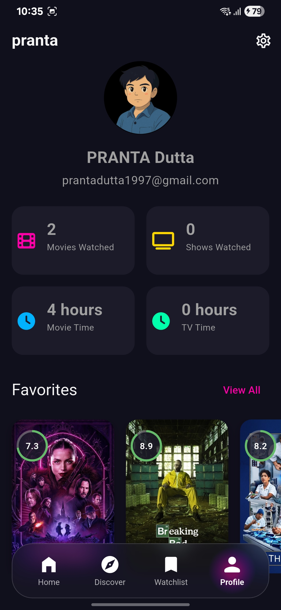
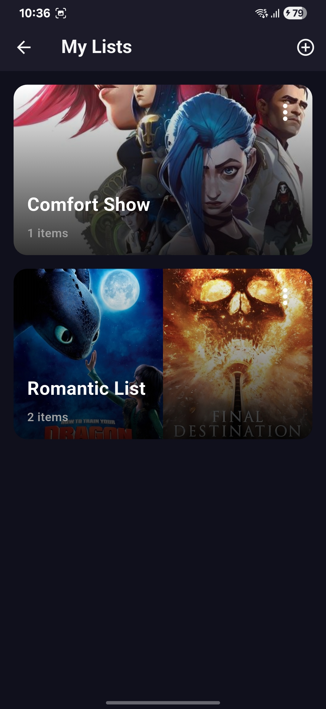
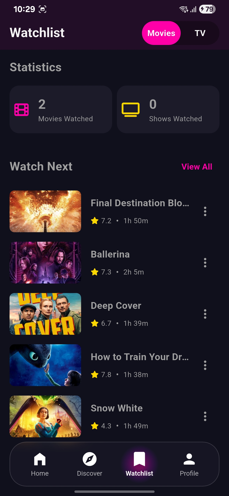
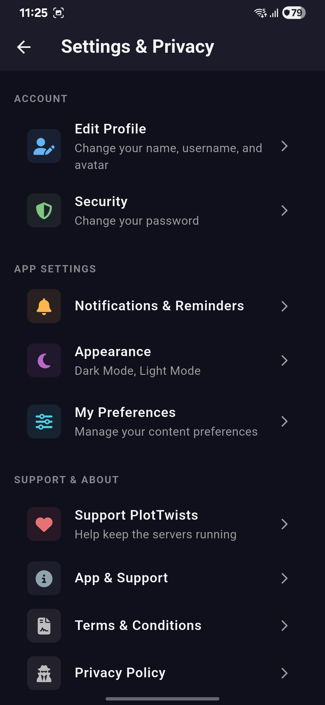

# PlotTwists 🎬

**Your personal cinema diary. Track, discover, and curate movies & TV shows with a beautiful, modern interface.**

---


## ✨ Introduction

PlotTwists is a feature-rich mobile application for movie and TV show enthusiasts, built with Flutter and powered by the TMDB API. It serves as an all-in-one companion to manage your viewing history, discover new titles through an interactive interface, and curate personal lists for any mood or occasion. The app is built with a focus on a clean, beautiful user experience and a robust, scalable architecture.

## 🚀 Key Features

* **Firebase Authentication:** Secure sign-up and login with Email/Password and Google Sign-In.
* **Dynamic Home Screen:** A personalized dashboard showing trending movies and TV shows, your watchlist, and more.
* **Interactive Discover Deck:** A fun, Tinder-like swipe interface to discover new titles and quickly add them to your watchlist.
* **Feature-Rich Detail Screens:** Immersive pages for every movie and TV show, featuring:
    * In-app YouTube trailer playback.
    * Detailed cast and crew carousels.
    * Full season and episode guides for TV shows.
    * Action buttons to add to watchlist, mark as watched, or favorite.
* **Smart Library Management:**
    * **Watchlist:** Keep track of everything you want to watch.
    * **Watched History:** A log of all the content you've seen, with stats like total watch time.
    * **Favorites:** A special list for the movies and shows you truly love.
* **Custom Lists:** Create, edit, and manage your own themed lists for any occasion (e.g., "Best Sci-Fi of the '90s," "Comfort Movies").
* **Personalized Profile:** A beautiful profile screen that serves as your "cinematic identity," showcasing your avatar, stats, and curated lists.
* **Advanced Settings:** Full control over your experience with preferences for content, notifications, and app appearance (including Light/Dark/System themes and accent colors).

## 📸 Screenshots

Here are some screenshots from the app:

| Home Screen | Discover | Profile |
| :---: | :---: | :---: |
|  |  |  |
| **My Lists** | **Watchlist** | **Settings** |
|  |  |  |

## 🛠️ Tech Stack & Architecture

This project is built with a modern, scalable technology stack and follows Clean Architecture principles to separate presentation, application, and data layers.

* **Platform:** Flutter
* **State Management:** Riverpod (with Code Generation)
* **Backend & Database:** Firebase (Authentication, Firestore, Cloud Storage)
* **API:** The Movie Database (TMDB)
* **Networking:** Dio
* **UI & Animations:** `flutter_animate`, `flutter_card_swiper`
* **Local Persistence:** `shared_preferences`
* **Utilities:** `font_awesome_flutter`, `package_info_plus`, `url_launcher`, `Youtubeer_flutter`, `flutter_markdown`

## ⚙️ Setup and Installation

To run this project locally, follow these steps:

1.  **Clone the repository:**
    ```sh
    git clone [https://github.com/your-username/plottwists.git](https://github.com/your-username/plottwists.git)
    cd plottwists
    ```

2.  **Set up Firebase:**
    * Create a new project on the [Firebase Console](https://console.firebase.google.com/).
    * Add an Android and/or iOS app to your Firebase project.
    * Follow the setup instructions to add the `google-services.json` (for Android) and `GoogleService-Info.plist` (for iOS) files to your project.
    * Enable **Authentication** (Email/Password, Google), **Firestore Database**, and **Storage**.

3.  **Create `.env` file:**
    * Create a file named `.env` in the root of the project.
    * Add your secret keys to this file. You will need to get your own API key from TMDB.
    ```env
    TMDB_API_KEY=your_tmdb_api_key_here
    GOOGLE_WEB_CLIENT_ID=your_google_web_client_id_from_google-services.json
    ```

4.  **Install dependencies and run:**
    ```sh
    flutter pub get
    flutter run
    ```

---
Built with ❤️ by Pranta Dutta. It's been an awesome journey building this!